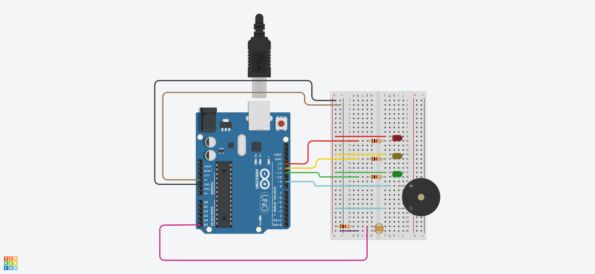

# EDGE COMPUTING CP
# 🔅 Sistema de Monitoramento de Luminosidade para Vinheria Agnello

## ♦ Descrição do Projeto
O sistema desenvolvido para a Vinheria Agnello tem como objetivo monitorar as condições de luminosidade do ambiente onde os vinhos são armazenados. A qualidade do vinho pode ser impactada diretamente por fatores como temperatura, umidade e luminosidade, e este sistema visa garantir que a luminosidade esteja sempre dentro dos limites recomendados para preservar a qualidade do vinho. O primeiro desafio consiste na implementação de um sistema de monitoramento utilizando Arduino e sensores de luminosidade LDR (Light Dependent Resistor).

## ♦ Funcionalidade
- O sistema utiliza um sensor LDR para capturar os dados de luminosidade do ambiente.
- Dependendo da intensidade da luz medida, um sistema de alarme visual é acionado:
  - LED verde: luminosidade dentro dos parâmetros ideais (OK).
  - LED amarelo: luminosidade em níveis de alerta.
  - LED vermelho: luminosidade fora dos limites estipulados (problema).
- Caso a luminosidade atinja níveis de alerta, um buzzer será ativado por 3 segundos. O buzzer continuará soando enquanto os níveis de luminosidade permanecerem fora da faixa ideal.

## ♦ Dependências
Este projeto utiliza os seguintes componentes e bibliotecas:
- **Arduino Uno** ou qualquer outro modelo de Arduino compatível.
- **Sensor LDR** (Light Dependent Resistor) para medição da luminosidade.
- **LEDs** (verde, amarelo e vermelho) para sinalização do status do ambiente.
- **Buzzer** para alerta sonoro em caso de luminosidade em nível de alerta.
- **Resistor de 10kΩ** para configurar o divisor de tensão com o LDR.
- **Biblioteca Arduino IDE** para programação e upload do código no Arduino.

## ♦ Como Reproduzir o Projeto

### 1. Materiais Necessários:
- 1x Arduino Uno
- 1x Protoboard 
- 12x Jumpers
- 1x LDR (Light Dependent Resistor)
- 4x Resistor de 1kΩ
- 3x LEDs (verde, amarelo e vermelho)
- 1x Buzzer

### 2. Montagem do Circuito:
1. Conecte o barramento positivo da protoboard ao 5V do Arduino.
2. Conecte o barramento negativo da protoboard ao GND do Arduino.
3. Conecte o LED vermelho no pino digital 13 do Arduino.
4. Conecte o LED amarelo no pino digital 12 do Arduino.
5. Conecte o LED verde no pino digital 11 do Arduino.
6. Coloque um resistor entre o terminal positivo de cada LED e o fio que vai para o pino do Arduino.
7. Ligue o terminal positivo do buzzer no pino digital 9 do Arduino e o terminal negativo no GND.
8. Um lado do LDR conecta ao 5V do Arduino e o outro lado do LDR conecta ao pino analógico A5.
9. Entre o pino A5 e o GND, adicione um resistor de 10kΩ.

### 3. Como Rodar o Código:
1. Conecte o Arduino ao computador e abra a IDE do Arduino.
2. Selecione o modelo correto do Arduino na IDE e a porta COM.
3. Insira o codigo para a IDE e faça o upload para o seu Arduino.
4. Observe o comportamento dos LEDs e do buzzer conforme a luminosidade medida pelo LDR.

## ♦ Representação do projeto

## Nome Integrantes e RM

Guilherme de Araújo Moreira - RM: 561848

Camila de Mendonça da Silva - RM: 565491

Arthur de Sousa Pereira - RM: 561380

Yan Breno Barutti Conceição - RM: 566412

### 💻 Tecnologias utilizadas

